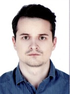

# CV 

**Name:** Yuheni  
**Surname:** Yaromich  
## Contact information
**Email address:** [Yuheni Yaromich](mailto:jane19937788@gmail.com)  
**Phone:** +375445957046  
**Telegram:** @JYaromich

## About myself
I have been programming in Python for 2 years. Studied machine learning and deep learning from scratch. The list of my soft skills includes multitasking,
communication, responsibility. I hope that my industrial experience can help a
company to create useful applications. 
## Skills
**Programming languages:**
* *Python*. Primary language. I have been using libraries such as SQLAlchemy,
NumPy, Pandas, MatplotLib, Seaborn, TensorFlow, PyTorch, Scrapy, bs4, Scikitlearn
* *Familiar with the following languages*: C#, С, С++, Object Pascal, Assembler, Java
* *Databases*: MySQL, MongoBD, SQLite
* *Operating systems*: Linux, Windows, macOS
* *Other technologies*: Git, Docker
## Professional Experience 
**Lead reactor control engineer (2016-Present) Belarusian NPP** 
My responsibilities include controlling and managing a technology process. I
participated in an equipment input control, controlling of a building process and reporting documentation

**SettingEditor (2016) ADANI** 
*Technologies*: Object Pascal, Git
I’ve developed user interface for interaction with an x-ray machine

**SXRS format (2016) ADANI** 
*Technologies*: Object Pascal, Git 
I’ve developed libraries to use universal format for x-ray photos SXRS.
## Code
The sample of my code you can find in my public repository [GitHub](ttps://github.com/JYaromich)

## Projects
**Telegram-bot with a dialog system and products query (Pet-project)** 
I have been developing a Telegram-Bot to handle users’ queries and maintaining a conversation with them. 
*Technologies*: Python, Scrapy, Beautiful Soup, Transformers, Datasets, Git,
TensorFlow, PyTorch

**ReactorDepartmentBase** 
I’ve developed DB for a Reactor Department to control a building process on NPP  
*Technologies*: MySQL, C#

## Education
* **BSc:** in physics
* **Department:** Nuclear Physics and technology
* **GPA:** 8 out of 10
* **Batchelor thesis:** “Programming for STM-32”
## Language
* **English**. The level of proficiency B2
* **Russian**. Mother tongue

